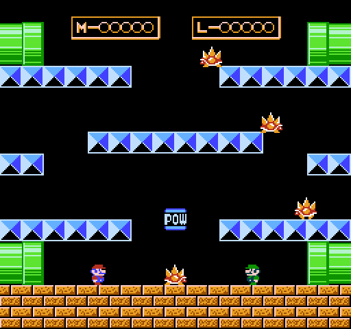

# mario battle, in rive

the two player "Mario Bros." battle game hidden in Super Mario Bros. 3 (NES), rebuilt as a single `.riv` file
with the [Rive CLI](https://rive.app/docs/cli): RML markup for the stage, hud and every component, Luau scripts
for the simulation. every rule and physics number is transcribed from [the game's disassembly](https://github.com/captainsouthbird/smb3),
with one deliberate exception, the turn-around deceleration, listed in `docs/rules.md`.



## play

```bash
rive login            # once
rive . --fit=contain  # opens the viewer, resize it to full screen
```

the title is a start menu: each player moves a cursor over the mario and luigi cards, jump locks a brother,
jump on START (or the start button) launches. a brother nobody locked is played by the cpu, a strong one: it
runs the battle 48 frames ahead on a clone before every move, flips enemies from below with frame-exact bumps,
kicks them, hits the pow, and plays it against you: bumps the block under you, stomps you dizzy, rights a downed
enemy under your feet. one player fights it, no player at all is a cpu vs cpu demo. gamepads first (first pad is p1,
second p2, B jumps, Y runs, plus starts and pauses), keyboard fills the empty slots: p1 on `W A S D` + `G`
jump + `F` run, p2 on the arrows + `K` jump + `L` run. `F1` shows the collision boxes.

five enemies come out of the top pipes. bump the platform under one to flip it, touch it while it is on its
back to kick it off and take its coin. three coins win. touching a live enemy or a fireball ends the round.
the pow block in the middle flips everything on the ground, three times.

## how it is built

- `scene/game.rml` is the 256x240 artboard: it places the components (the overlays, the start menu, four hud
  slots, one stage per layout) and hosts the playfield script; a state machine shows the menu and the stage
- `scene/components/` holds one component artboard per entity (Player, Spiny, FighterFly, Sidestepper, Pow,
  Fireball): frames in a `Solo`, one animation per pose, a small state machine driven by the entity's view
  model; and the hud slot, menu and overlay components, bound to their own view model where they are placed
- `scene/stages/` holds one component artboard per stage: the art, and a tile map the simulation plays
  (see `docs/rules.md`, "stages"); with several stages a round picks one at random
- `scripts/` is the game: a fixed 60 step loop in `game.luau`, with `players`, `enemies`, `fireballs`, `world`,
  `physics` and `stage` modules and their unit tests (`rive . --test`)
- `docs/rules.md` has every constant with the label it came from in the disassembly, and the credits
- `AGENTS.md` has the verify / inspect / test / screenshot loop and the gotchas

the sim is deterministic integer physics in sixteenths of a pixel, exactly like the rom, so the jump takes 33
frames to its apex and reads 71 px, and the enemies walk at 0.375 px per frame until they get up faster.

## credits and status

a fan project, non commercial. Mario, the characters, sprites, sounds and music belong to Nintendo. the
sprite rips come from the Super Mario Wiki, mariouniverse.com (SamsterBoy) and the Spriters Resource
(Doc von Schmeltwick), the sounds from The Mushroom Kingdom, the rules and physics from the
[SMB3 disassembly](https://github.com/captainsouthbird/smb3) by southbird (http://www.sonicepoch.com/sm3mix/).
the font is Press Start 2P (OFL). the code in `scripts/`, `scene/` and `tools/` is MIT, see `LICENSE`; the
files under `assets/` and `tools/sheets/` are not covered by it.

built in a day with Claude Code, plan and process in the commit history.
